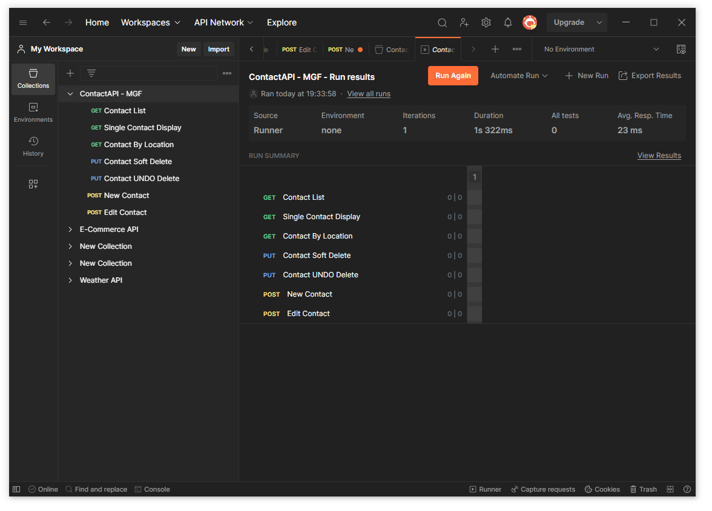

# MGF PHP API BACKEND
(API EndPoints for ContactAPI CRUD with Soft Delete and Location lookup.) 

 

 

 

 

## SETUP REQUIREMENTS - Install the follow;
* PHP 8.1.*
* MySQL
* XAMPP for Windows 8.1.17 ***Preferred Recommendation for Web Server***
* Postman API Platform

## DEPLOYMENT STEPS 1 - WEB ROOT FILES - After setting up the web sever

* Download the the folder  ***ContactAPI** : The folder contain all the backend files.
* Copy the folder " ContactAPI " to " C:\xampp\htdocs "

## DEPLOYMENT STEPS 2 - DATABASE SETUP 

* CREATE a Database called " contactdb " inside MySQL Database Engine via MyPHPAdmin: http://localhost/phpmyadmin/ from your local system.

* DATABASE HOST: 'localhost'
* DATABASE USER: 'root'
* DATABASE PASSWORD: ""
* DATABASE NAME: ''contactdb''

## DEPLOYMENT STEPS 3 - POSTMAN Setup

* After postman installation 
* Import the Json file name "ContactAPI - MGF.postman_collection.json"
* ***Be sure to have setup your web sever and database connect ***
* Then proceed to Testing of the Endpoints. 

## DEPLOYMENT STEPS 4 - End Point

* List of Contacts : http://localhost/contactapi/src/api/contact/list.php 

* Single Contacts :  http://localhost/contactapi/src/api/contact/single.php?id=117 

* Contacts By Location : http://localhost/contactapi/src/api/contact/location.php?postcode=l9

* Soft Delete Contact  :    http://localhost/contactapi/src/api/contact/delete.php?id=47

* Restore Contact (UNDO Deletion) : http://localhost/contactapi/src/api/contact/restore.php?id=46

* Add New Contact : http://localhost/contactapi/src/api/contact/newcontact.php

* Edit Contact : http://localhost/contactapi/src/api/contact/editcontact.php?id=117

and more in-process end points.

## FOR SUPPORT
* If you run into any challenges during setup, contact me via ***iamyombo@outlook.com*** or Call#

*** Thank You! ***

